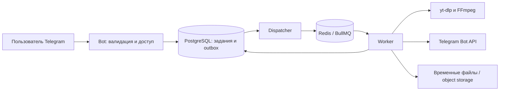

# Практические проекты

[Маршрут](README.md) · [Этапы](ROADMAP.md)

Три проекта дают разные виды практики. Их реализация входит в часы этапов; отдельного
дополнительного бюджета «на проекты» нет. Не требуется коммерческий дизайн, большое
число экранов или функции, которые не проверяют новый навык.

| Проект         | Личная польза                                             | Главный новый опыт                                    | Где выполняется |
| -------------- | --------------------------------------------------------- | ----------------------------------------------------- | --------------- |
| Spendboard     | Видеть расходы на свои продукты и даты продления сервисов | SQL, API, auth, тесты, конкурентное редактирование    | 1, 3–5          |
| Audio Bot      | Получать аудио по YouTube-ссылке в личном Telegram-боте   | Очереди, subprocess, файлы, лимиты, отказы интеграций | 6–8             |
| Feedback Inbox | Собирать обратную связь пользователей своих приложений    | Изоляция SaaS-клиентов, тарифы, платежи и webhooks    | 9–10            |

После первого проекта переносить понятные настройки, а не переписывать их с нуля.
Новая предметная логика остаётся самостоятельной. Web UI можно сгенерировать; все правила
и права проверяет сервер. Бот использует Telegram как готовый интерфейс.

## Проект 1. Spendboard — расходы на свои продукты

### Пользовательский сценарий

Записать оплату VPS, домена, API или рабочего инструмента, связать её с собственным проектом,
увидеть расходы за месяц и ближайшие продления. Начать можно с одной валюты, сохранив
явное поле валюты; при нескольких валютах показывать отдельные итоги.

### Минимальный объём

- Проекты с названием и состоянием active/archived.
- Расход: проект, сумма, валюта, дата, категория, краткая заметка.
- Повторяющаяся трата: сервис, цена, период и следующая дата оплаты, вводимая вручную.
  Автоматическое месячное расписание и списания не входят в MVP.
- Список с фильтрами и ограниченной пагинацией; итоги за период по проекту/категории/валюте.
- Ближайшие продления и архивирование проекта без потери истории.
- Личный вход, восстановление доступа и отзыв сессий.
- Три простых экрана: обзор, расходы, продления; одинаковые формы не требуют отдельного дизайна.

Ориентировочные сущности: `users`, `sessions`, `projects`, `expenses`, `recurring_costs`.
Точный DDL — самостоятельная задача этапа 1. Связь с пользователем добавляется вместе
с auth и миграцией существующих учебных записей, если её не заложили сразу.

### Этапы готовности

1. Схема, seed и SQL-отчёты — конец этапа 1.
2. Локальное API, тесты и UI — конец этапа 3.
3. Приватная версия, которой можно пользоваться, — конец этапа 4.
4. Защита от потерянного редактирования и объяснённые транзакции — конец этапа 5.

### Приёмка

- [ ] Расход отражается ровно в нужном периоде с учётом выбранной семантики даты.
- [ ] Проект без расходов присутствует в подходящем отчёте с нулём, а не случайно исчезает из JOIN.
- [ ] Деньги не теряют точность на границе БД/JS; разные валюты не складываются напрямую.
- [ ] Архив не уничтожает финансовую историю.
- [ ] Пользователь B не читает/меняет расход A и не видит его в агрегатах.
- [ ] Две правки одной версии не приводят к молчаливой потере данных.
- [ ] Миграции работают на пустой БД и на БД предыдущей версии с данными.
- [ ] Есть инструкция запуска, несколько содержательных API/DB-тестов и примеры запросов.

**Не добавлять в MVP:** банковские интеграции, распознавание чеков, бухгалтерию,
автоконвертацию валют, общий семейный бюджет и сложные повторяющиеся расписания.
CSV-экспорт — полезное расширение только после закрытия основной приёмки.

## Проект 2. Audio Bot — личный Telegram-бот для аудио

### Пользовательский сценарий

Отправить YouTube-ссылку, получить подтверждение принятия, затем аудиофайл и понятный итог.
История и команда статуса позволяют понять судьбу задания после перезапуска.
Для воспроизводимых проверок использовать свои или разрешённые к скачиванию материалы.

### Устройство

Bot, dispatcher и worker — роли. Не обязательно делать три сервиса с отдельными
репозиториями: небольшой dispatcher может жить в одном из долгоживущих процессов.
Долгая обработка выполняется вне процесса, принимающего сообщения.

### Минимальный объём

- Доступ по allowlist числовых Telegram user ID, без публичной регистрации и оплаты.
- Одна ссылка на один ролик; один выбранный формат результата, например MP3.
- Команды `/start`, `/help`, `/status <id>`, `/history`; понятные сообщения об отказах.
- Устойчивый ID задания, связь с владельцем, источник, время, состояние, число попыток,
  код ошибки и метаданные результата.
- Ограниченная очередь и worker с настраиваемой конкурентностью.
- Доставка результата и повторная выдача готового файла без повторной конвертации,
  пока он сохранён; очистка по сроку хранения.

Начальные учебные лимиты: 1 работа одновременно на worker, 2 ожидающие задачи на пользователя,
10 минут длительности ролика и 5 минут общего времени обработки. Это собственные настройки
MVP, а не ограничения YouTube; скорректировать их после измерений на своём хосте.
Предельный размер результата взять с запасом ниже актуального лимита Telegram.

По проверенной 2 октября 2026 документации `sendAudio` принимает MP3/M4A до 50 MB через
обычный Bot API. Перед реализацией перепроверить лимиты и выбирать формат осознанно.
[Telegram sendAudio](https://core.telegram.org/bots/api#sendaudio).

### Состояния и важные границы

| Ситуация                       | Требуемое поведение                                                              |
| ------------------------------ | -------------------------------------------------------------------------------- |
| Ссылка принята                 | Задание и outbox записаны атомарно; пользователь получает ID                     |
| Redis недоступен после записи  | Задание остаётся ожидающим отправки, dispatcher повторяет её позже               |
| Повтор Telegram update         | Не создаёт новое задание благодаря уникальному update ID                         |
| Повтор job                     | Не перезаписывает завершённый результат и не запускает лишнюю обработку          |
| Worker умер в процессе         | Задача возвращается к обработке по ограниченной политике, старые файлы убираются |
| Постоянный отказ источника     | Конечный failed с понятной причиной без бесконечного retry                       |
| Временный отказ                | Ограниченный retry с задержкой и общим бюджетом времени                          |
| Отправка аудио успешна         | Сохранены результат и факт доставки                                              |
| Отправка завершилась таймаутом | Состояние delivery_unknown; файл сохранён для явной повторной отправки           |

Состояние доставки лучше отделить от состояния обработки. Telegram мог принять файл
до обрыва соединения; автоматически обещать отсутствие дубля нельзя. Для MVP выбрать
явную повторную выдачу пользователем при `delivery_unknown` и объяснить возможный дубль.

### Внешний медиоинструмент

Использовать готовые [yt-dlp](https://github.com/yt-dlp/yt-dlp) и FFmpeg, а не писать
парсер YouTube. Перед началом проверить текущие зависимости yt-dlp, включая Python/JS runtime
для выбранного способа установки. Зафиксировать рабочую версию в образе; обновлять по
результатам smoke-проверки. Работоспособность источника со временем меняется.

Для детерминированных тестов адаптер скачивания/конвертации возвращает локальный fixture.
Один отдельный smoke на контролируемом ролике проверяет живую интеграцию. Если источник
временно недоступен, продолжать изучение очереди на fixture; реальное скачивание остаётся
непроверенным пунктом, пока smoke не пройдёт.

### Ограничения процесса и входа

- Разбирать URL, извлекать допустимый video ID и собирать каноническую ссылку на известный host.
  Плейлисты, произвольные домены, пользовательские аргументы CLI и batch-загрузки не принимать.
- Запускать `spawn(executable, args)` без shell; пути и имена файлов задаёт приложение.
  Пользовательский текст не должен становиться shell-командой или путём вывода.
- Учесть SSRF за редиректами/разрешением DNS: изолированный worker не имеет доступа к
  внутренней сети и metadata endpoints. Одна проверка начального hostname не гарантирует защиту.
- В дочерний процесс передавать минимальное окружение без DB/Bot-токенов и других секретов.
- Ограничивать ресурсы во время работы: предварительные метаданные ролика могут быть неточны.
- Очищать файлы через `finally` и отдельную уборку после crash; не полагаться только на `finally`.
- Не включать вход в чужие аккаунты, обход DRM/платного доступа или передачу браузерных cookies.

### Приёмка

- [ ] Контролируемая YouTube-ссылка превращается в воспроизводимый аудиофайл в Telegram.
- [ ] Пока идёт конвертация, `/status` отвечает быстро.
- [ ] Повтор update/job не создаёт лишнюю бизнес-операцию.
- [ ] Разрыв между записью БД и очередью воспроизводится и восстанавливается.
- [ ] Перезапуск worker не оставляет вечную задачу `processing`.
- [ ] Большой/долгий/недоступный ролик даёт конечный и понятный результат.
- [ ] Пользователь не получает историю или результат другого Telegram ID.
- [ ] Таймаут доставки не маскируется как достоверная недоставка.
- [ ] Очистка работает после успеха, ошибки и аварии процесса.
- [ ] На этапе 7 приватный файл доступен по ограниченной ссылке и исчезает по сроку хранения.

**Не добавлять в MVP:** поиск музыки, каталог, рекомендации, плейлисты, публичное
распространение, оплату, несколько платформ и свой Telegram Bot API server ради больших файлов.

## Проект 3. Feedback Inbox — обратная связь для своих приложений

### Пользовательский сценарий

В каждом собственном продукте разместить маленькую форму «Предложить улучшение / сообщить
о проблеме». Обращения собираются в отдельном кабинете по проектам; владелец помечает их
как new/in_progress/done. При необходимости тот же сервис можно предложить другому автору.

Практическая польза есть уже с одним workspace. Второй нужен для проверки изоляции и
платёжного сценария, а не для обязательного запуска бизнеса.

### Минимальный объём

- Workspace, проекты, owner/member и обращения с категорией/текстом/статусом.
- Публичная форма или endpoint отправки с ограничениями частоты и размера текста.
  Public project key определяет назначение обращения, но не даёт доступ к кабинету.
- Приватный список, фильтр по проекту/статусу и смена статуса.
- Аудит смены тарифа, роли и ручных billing-действий с actor и временем.
- Тариф Free: 1 активный проект; Pro: 5. Простая явная квота вместо десятков возможностей.
- Sandbox-покупка 30 дней Pro, webhook, срок действия, полный возврат и сверка.
- Три небольших UI-сценария: отправка обращения, inbox, тариф/состояние покупки.

Ориентировочные сущности: `workspaces`, `memberships`, `projects`, `feedback`,
`payments`, `payment_events`, `access_grants`, `audit_events`. Пользователи и сессии
переиспользуют уже понятное решение. Создавать собственную IAM-платформу не требуется.

### Границы доверия

Tenant определяется по проверенному membership или public project key в зависимости
от endpoint. Переданный клиентом `workspaceId` не является разрешением на доступ.
Публичная форма не должна позволять прочитать список, менять статус или назначать себя owner.
Строки обращения показываются в UI как текст; rich HTML/вложения отложены.

Tenant isolation проверяется отдельными тестами для чтения, изменения, агрегатов,
фоновой работы и доступа по вложенному ресурсу. Одного успешного теста middleware мало.

### Минимальные правила оплаты

| Событие                              | Решение MVP                                                                 |
| ------------------------------------ | --------------------------------------------------------------------------- |
| Пользователь нажал «Оплатить»        | Сервер выбирает фиксированный товар/цену и создаёт платёж с idempotency key |
| Браузер вернулся из checkout         | UI показывает подтверждение в процессе, сервер сверяет состояние            |
| Оплата подтверждена провайдером      | Создаётся связанный с этим payment grant на 30 дней                         |
| Уведомление повторилось              | Повторный grant не создаётся                                                |
| Неизвестное/недоверенное уведомление | Не меняет права; сохраняется диагностическая причина без секретов           |
| Полный возврат                       | Отзывается grant именно этого платежа; другие основания доступа сохраняются |
| Срок Pro истёк                       | Действует Free; существующие проекты и обращения не удаляются               |
| Ресурсов больше лимита Free          | Читать/обрабатывать старые можно, создавать новые активные проекты нельзя   |
| Уведомление потерялось               | Сверка через API провайдера доводит состояние до актуального                |

Для первого сценария достаточно одной покупки и одного возврата. Повторные продления
проверить отдельно: описать, от какого момента считается новый период, и доказать,
что дубликат события не продлевает его дважды. Время проверяется по серверным данным;
тесты используют управляемые часы.

Sandbox выбирается по доступности продавцу. Проект не требует реальных платежей,
автосписаний или оформления бизнеса на учебном этапе. Fake gateway нужен для отказов
и редких событий, но не заменяет приёмку настоящей тестовой интеграции.

### Приёмка

- [ ] Форма из своего приложения создаёт обращение в нужном проекте.
- [ ] Участник другого workspace не видит обращение даже с известным ID.
- [ ] Публичный ключ не открывает административные операции.
- [ ] Два параллельных запроса не превышают квоту проектов.
- [ ] Оплата проходит в sandbox; браузер не может сам назначить Pro.
- [ ] Повторные/переставленные события, возврат и истечение срока обработаны по правилам.
- [ ] Потерянный webhook восстанавливается сверкой с провайдером.
- [ ] Есть история billing-решений, инструкция поддержки и воспроизводимый деплой.

**Не добавлять в MVP:** голосование, чат, публичный roadmap, email-рассылки, файлы,
сложные приглашения, маркетплейс интеграций, много валют, купоны и несколько платёжных систем.

## Как не тратить время на повторения

Первый раз самостоятельно собрать путь HTTP → валидация → бизнес-операция → БД → тест.
В следующем проекте переносить каркас и проверять, что настройки соответствуют новому
контексту. Не копировать tenant/auth/payment-правила без пересмотра границ доверия.

Если проект перестал быть полезен, можно заменить предметную область, сохранив учебный
результат: проект 1 должен содержать SQL-отчёты и auth, проект 2 — долгую фоновую работу и
внешнюю доставку, проект 3 — несколько клиентов и надёжный платёжный сценарий.
Audio Bot включён по явному запросу; менять его на другое приложение без обсуждения не нужно.
